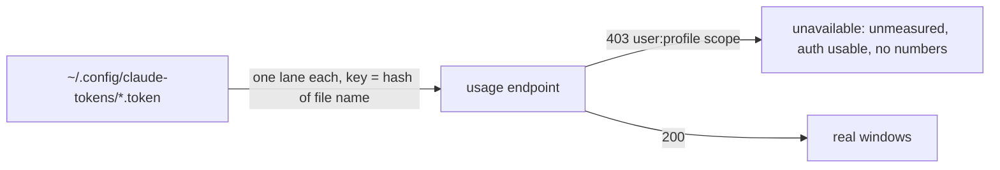

```mermaid
flowchart LR
  A[~/.config/claude-tokens/*.token] -->|one lane each, key = hash of file name| B[usage endpoint]
  B -->|403 user:profile scope| C[unavailable: unmeasured, auth usable, no numbers]
  B -->|200| D[real windows]
```
